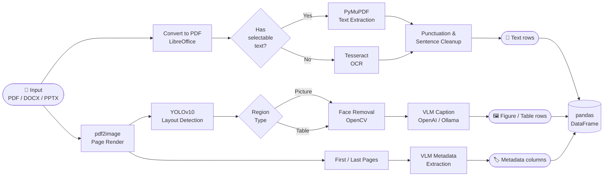
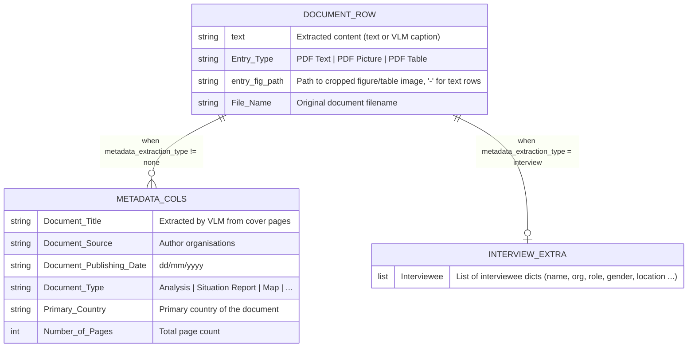
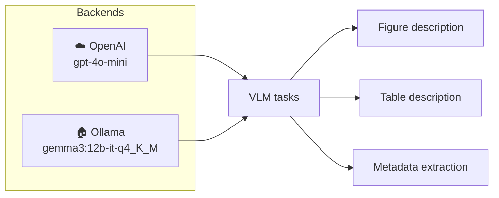
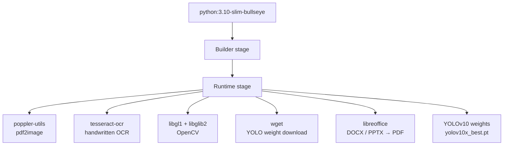

# DocumentsProcessing

A Python library for extracting text, figures, tables, and metadata from PDF and Office documents using vision-language models.

## Processing Pipeline



## Output Schema



### Entry types per row

| `Entry Type`  | `text`                                | `entry_fig_path`         |
|---------------|---------------------------------------|--------------------------|
| `PDF Text`    | Full document text (all pages joined) | `-`                      |
| `PDF Picture` | VLM description of the figure         | `/path/to/page_N_0.png`  |
| `PDF Table`   | VLM description of the table          | `/path/to/page_N_0.png`  |

---

## Installation

**Prerequisite** — [LibreOffice](https://www.libreoffice.org) must be installed to process `.docx`/`.doc`/`.pptx` files.

```bash
# From PyPI-compatible source
pip install git+https://github.com/MediaMonitoringAndAnalysis/DocumentsProcessing.git

# Or editable install from a local clone
git clone https://github.com/MediaMonitoringAndAnalysis/DocumentsProcessing.git
cd DocumentsProcessing
pip install -e .
```

---

## Supported Formats

| Format | Extension | Converter |
|--------|-----------|-----------|
| PDF    | `.pdf`    | Native    |
| Word   | `.docx` `.doc` | LibreOffice |
| PowerPoint | `.pptx` | LibreOffice |

---

## Inference Backends



| Backend  | Model                    | Requires                    |
|----------|--------------------------|-----------------------------|
| `OpenAI` | `gpt-4o-mini`            | `OPENAI_API_KEY` env var    |
| `Ollama` | `gemma3:12b-it-q4_K_M`  | Local [Ollama](https://ollama.ai) server |

---

## Usage

### Python

```python
import os
from documents_processing import DocumentsDataExtractor

extractor = DocumentsDataExtractor("OpenAI")   # or "Ollama"

results_df = extractor(
    file_name="report.pdf",
    doc_folder_path="data/original_docs",
    figures_saving_path="data/figures",
    metadata_extraction_type="document",   # "document" | "interview" | "none"
    extract_figures_bool=True,
)

results_df.to_csv("output.csv", index=False)
```

#### Custom model / API key

```python
extractor = DocumentsDataExtractor(
    inference_pipeline_name="Ollama",
    model_name="llava:13b",
    api_key=None,
)
```

#### Text-only extraction (no VLM needed)

```python
extractor = DocumentsDataExtractor(inference_pipeline_name=None)

results_df = extractor(
    file_name="report.pdf",
    doc_folder_path="data/original_docs",
    figures_saving_path="data/figures",   # still required but unused
)
```

#### Page-by-page text (keep page structure)

```python
results_df = extractor(
    file_name="report.pdf",
    doc_folder_path="data/original_docs",
    figures_saving_path="data/figures",
    return_original_pages_numbers=True,
)
# results_df["text"].iloc[0]  →  {"page 1": "...", "page 2": "...", ...}
```

---

### CLI

```bash
# Text + figures + document metadata
python -m documents_processing.cli \
  --file report.pdf \
  --data-dir data \
  --inference OpenAI \
  --extract-figures \
  --metadata-type document \
  --output output.csv

# Interview document
python -m documents_processing.cli \
  --file interview.pdf \
  --data-dir data \
  --inference Ollama \
  --metadata-type interview \
  --output output.csv
```

| Flag | Default | Description |
|------|---------|-------------|
| `--file` | *(required)* | Document filename (must exist inside `--data-dir/original_docs/`) |
| `--data-dir` | `data` | Base directory; sub-folders `original_docs/` and `figures/` are created automatically |
| `--inference` | `OpenAI` | `OpenAI` or `Ollama` |
| `--metadata-type` | `none` | `document`, `interview`, or `none` |
| `--extract-figures` | off | Flag to enable figure/table extraction |
| `--doc-url` | `None` | Download URL if the file is not present locally |
| `--output` | `output.csv` | Output CSV path |

---

### Flask API

Start the server:

```bash
python main_documents_extraction.py
# listening on http://0.0.0.0:5000
```

#### Endpoints

```
GET  /health          → {"status": "ok"}
POST /extract-doc     → extraction result
```

#### `POST /extract-doc` — request body

```json
{
  "doc_filename":                  "report.pdf",
  "doc_folder_path":               "data/original_docs",
  "figures_saving_path":           "data/figures",
  "inference_pipeline":            "OpenAI",
  "metadata_extraction_type":      "document",
  "extract_figures":               true,
  "relevant_pages_for_metadata_extraction": null,
  "doc_url":                       null,
  "output_csv":                    "output.csv"
}
```

#### `POST /extract-doc` — response

```json
{
  "status": "success",
  "document_info": {
    "Document Title": "WASH Situation Report — Q1 2025",
    "Document Date":  "15/01/2025",
    "Document Source": ["UNICEF", "WHO"],
    "Number of Pages": 24
  },
  "data": [
    {
      "text": "Access to clean water remains critical ...",
      "Entry Type": "PDF Text",
      "entry_fig_path": "-",
      "File Name": "report.pdf",
      "Document Title": "WASH Situation Report — Q1 2025",
      "Document Publishing Date": "15/01/2025",
      "Document Source": "['UNICEF', 'WHO']",
      "Number of Pages": 24
    },
    {
      "text": {"page 3": "35% of households lack access to safe water ..."},
      "Entry Type": "PDF Picture",
      "entry_fig_path": "data/figures/report/Picture/page_2_0.png",
      "File Name": "report.pdf"
    }
  ],
  "csv_path": "output.csv"
}
```

---

## Docker

```bash
# Build
docker build -t documents-processing .

# Run Flask API (port 5000)
docker run -p 5000:5000 \
  -e openai_api_key=sk-... \
  -v $(pwd)/data:/app/data \
  documents-processing

# Run CLI one-shot
docker run --rm \
  -e openai_api_key=sk-... \
  -v $(pwd)/data:/app/data \
  documents-processing \
  python -m documents_processing.cli \
    --file report.pdf \
    --metadata-type document \
    --extract-figures
```

### What the image installs



---

## License

GNU Affero General Public License v3.0 — see [LICENSE](LICENSE).
